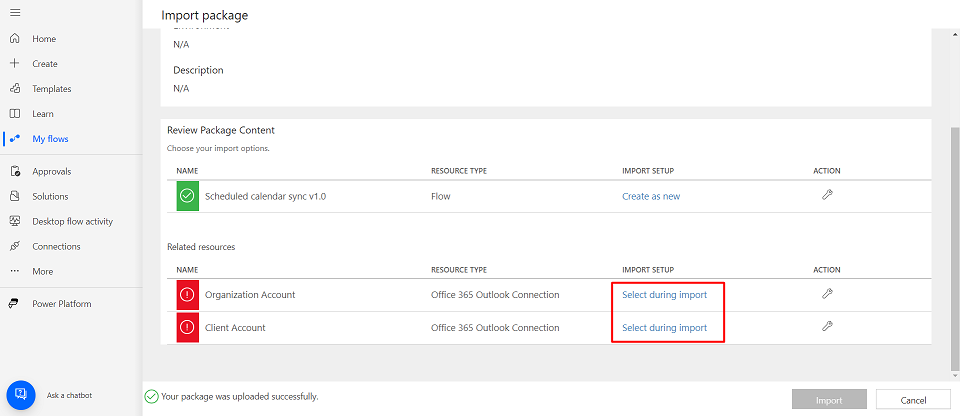
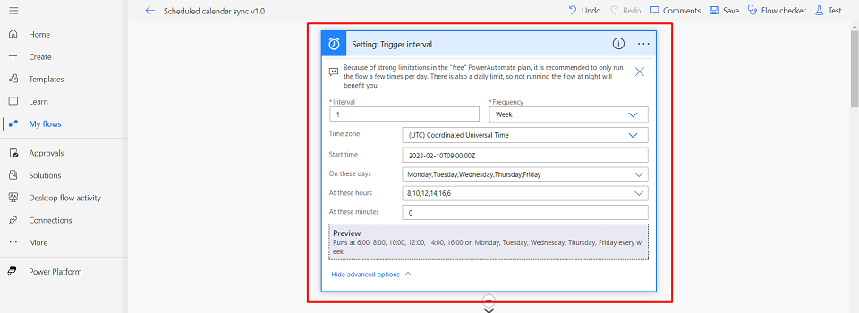

# How to sync Microsoft Outlook calendars

This repository provides a comprehensive guide and instructions on how to sync Outlook calendars using the Microsoft Power Automate platform. The primary goal of this synchronization process is to duplicate events and appointments between two separate calendar accounts: one from the organization's perspective and the other from the client's perspective. This means that events created or updated in one calendar will be automatically mirrored in the other, ensuring that both parties stay up-to-date without manual intervention.

We utilize Microsoft Power Automate to streamline this process. Power Automate is a tool that allows you to create automated workflows without requiring extensive programming knowledge. In this context, it serves as the engine that powers the calendar synchronization.

**Important:** Depending on your Power Automate plan, there are various limitations (see [documentation](https://learn.microsoft.com/en-us/power-automate/limits-and-config), also see [pricing](https://powerautomate.microsoft.com/en-us/pricing/)). Most notably, the “Action request limits” limit the number of triggerable actions to 10’000 per day. Power Automate counts the requests in the worst possible way (for you): exemplary, if you have a for-each-loop that loops over 5 items, and you define two actions inside the loop, Power Automate counts these as 5*2=10 action requests. Consequently, you need to experiment with the number of days you want to sync, and the number of flow executions per day, to stay below the action request limits.

---

**This tutorial based on [MShekow](https://github.com/MShekow/outlook-calendar-sync) solution on Microsoft Power Automate Platform for syncing Outlook calendars.**

---

Our solution represents an enhanced iteration of the existing system, offering users a more personalized and flexible experience:

1. **Dynamic Sync:** Our dynamic synchronization feature is a new highlight. It ensures that your calendar sync process is always optimized. Here's how it works:

    - **First Daily Execution:** When the synchronization process runs for the first time in a day, it will sync calendars for a comprehensive 30-day period. This is designed to capture a broad range of upcoming events and appointments

    - **Subsequent Daily Executions:** Any subsequent executions within the same day will operate differently. In this case, the system will sync calendars for a shorter 7-day period. This ensures that you stay up-to-date without overloading your calendar with unnecessary data

## The steps to create your own Microsoft Power Automate flow to sync Outlook calendars

1. Download the .zip file containing the Microsoft Power Automate flow from the repository [here](https://github.com/AnyCase-Company-LTD/Outlook-Calendars-Sync/raw/main/Calendars%20Sync%20Workflow.zip) to your local machine.

2. Follow the [link](https://make.powerautomate.com/) to login to Microsoft Power Automate Platform (**note:** login to organization account with license (e.g. Microsoft Office 365) that allows you to use Microsoft Power Automate Platform).

3. On the screen, you should see the **Connections** link in the left sidebar. If you don't see it, you can click the **More** link and find the **Connections** link there.

    

4. At the **Connections** tab you need to create two connections to your Microsoft Outlook account (e.g. add your organization account and your client account):

    - Click the **New Connection** button

        

    - Search for **Office 365 Outlook** in the list of available connections and click on it

        

    - Click the **Create** button in the popup

        

    - Follow the instructions to log in to your Microsoft Account. **You should do it twice for two different accounts** (e.g. organization account and client account)

        

5. After successful Connections creation you need to go to **My flows** tab, press the link **My flows** at left bar.

    

6. At the **My flows** tab you will see **Import** button, press it, then press **Import Package (Legacy)** button.

    

7. You will see the tab with file input, press **Upload** button and select .zip file from **Step 1**. It will take a while to upload file to platform.

    

8. At this step you need to use your created connections from **Step 4**. You need to click link **Select during import** and choose your created connections:

    - Click the link **Select during import**

        

    - Choose your created connections (you will see your connections in the list, if you don't see it, return and check **Step 4**). **Repeat this step for both accounts**

        

9. After selecting your connections press button **Import**.

    

10. Then you will see the screen about successful import.

    

11. After importing, navigate to the **My flows** tab (you can find instructions on how to navigate in **Step 5**) and open the created flow named **Scheduled calendar sync v1.0** (if it's not in the list, reload the page).

    

12. To enable the workflow, click the **Turn on** button.

    

---

## How to configure workflow with your settings (optional)

---

**Default Workflow Settings**: The workflow runs every weekday (Monday to Friday) at two-hour intervals during the working day (**UTC timezone**: 06:00, 8:00, 10:00, 12:00, 14:00, 16:00). At the 06:00 execution time, the workflow syncs calendars for 30 days; during other runs, it syncs calendars for 7 days.

If you wish to modify the default workflow settings to suit your preferences, please follow the instructions below:

1. Firstly, you need to open the workflow in edit mode. You can find instructions on how to do this above, at **Step 11**. Once there, press the **Edit** button.

    

2. If you want to change the execution times or days, open the **Setting: Trigger interval** block and configure it with your desired values.

    

    **Note:** if you update run hours also you have to update additional settings:

    - Update **Setting: First execution time** with the same value as first run time from trigger (write it in **HH:mm** format)

        

3. If you don't need the dynamic setup of days to sync (first execution syncs for 30 days, other executions sync for 7), and you want to sync the same days consistently, update **Setting: Need dynamic days to sync** (set it to "true" if dynamic logic is needed, set it to "false" if dynamic logic is not needed).

    

    Also, update **Setting: Days to sync** with your desired value.

    

4. If you're okay with the dynamic setup of days to sync but want to modify the values, update **Setting: First execution days to sync** and **Setting: Other executions days to sync**.

    

5. Also you can configure event prefixes for each caledar, you need to update **Setting: Prefix for events in Organization 1** and **Setting: Prefix for events in Organization 2**.

    

    **Note:** how it works:
    - You have **Calendar 1** with prefix **[Organization 1]:** and **Calendar 2** with prefix **[Organization 2]:**
    - You have **Event 1** in **Calendar 1** and **Event 2** in **Calendar 2**
    - During calendars sync invokation it will create in **Calendar 1** event with name **[Organization 2]: Event 2** and it will create in **Calendar 2** event with name **[Organization 1]: Event 1**

**Note:** If you don't need the calendars sync any more, you can press the button **Turn off** (you can find it using **Step 11** and **Step 12**, it will be at the same place as **Turn on** button).
